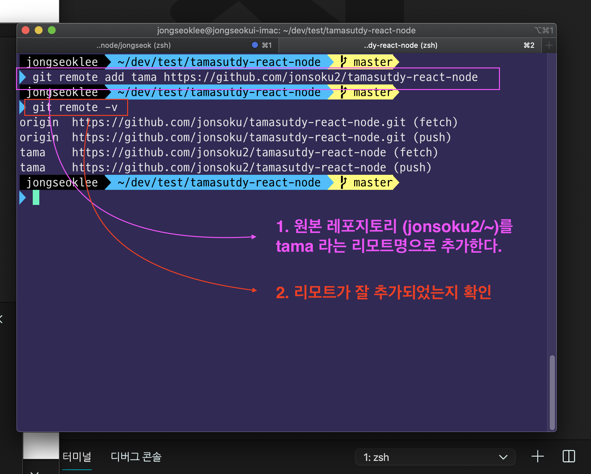

# git 작업 순서

## 원본 Repository

[원본 repo](https://github.com/jonsoku2/tamasutdy-react-node)

## 1. (최초) Fork

</img>

</img>

## 2. (최초) Clone

</img>

</img>

</img>

</img>

```bash
git remote add tama https://github.com/jonsoku2/tamasutdy-react-node
```

## 3. (최초) vscode 열기

</img>

## 4. (최초) 기존 프로젝트에서 server 폴더 및 react폴더 붙혀넣기

### 아래 스크린샷처럼 폴더명을 변경해주세요.

1. server -> tamastudy-node
2. tamastudy-react-part2 -> tamastudy-react

> 혹시 위와 다른분들께선 혼란스러워하지마시고 기존에 어떤 폴더명이던지 **node폴더**는 **tamastudy-node** **react폴더**는 **tamastudy-react**로만 바꾸시면됩니다 !

</img>

## 5. (최초) 각 폴더에 들어가서 .git 삭제하기

혹시 몰라 하는 것입니다. 설정이되어있을수도있으니.. 확인용으로
한번 해주세요.

### node폴더 내 git config 삭제

```bash
$ cd jongseok/tamastudy-node
$ rm -rf .git
```

### react폴더 내 git config 삭제

```bash
$ cd jongseok/tamastudy-react
$ rm -rf .git
```

## 6. 작업하기 전 반드시 해야할 사항

항상 원본 repo의 최신화된 것을 pull 받는다! 안받으면 conflict납니다. 20190215의 conflict 악몽..

```bash
$ git pull tama master
```

## 7. 자신의 작업내역을 push하기

일단 자신의 레포지토리에 push합니다.

```bash
$ git add .
$ git commit -m 'jongseok first commit'
$ git push origin master
```

## 7. 이후 pull request (PR) 진행!

# 스터디 참고 노션

### 깃 전체적인 부분

[notion - git](https://www.notion.so/Git-ec10d8d1770648ce904be22d4a81bb01)

### fork 부분

예전 아이디라 혼동이 되실수도있는데, 저번에 설명드린거 그림으로 나타낸거니 배우신거 떠올리시며 따라오시면 문제없으실겁니다 !

[pull request - 1](https://github.com/rakutenjongseok/tamastudy/blob/master/howToUseGit/03_Fork_pull_request.md)

[pull request - 2](https://github.com/rakutenjongseok/tamastudy/blob/master/howToUseGit/04_Fork_original_repository.md)
