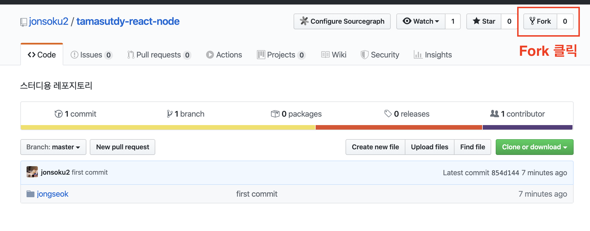
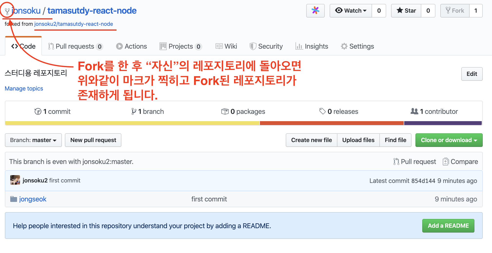
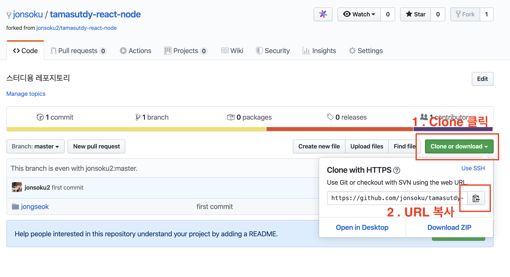
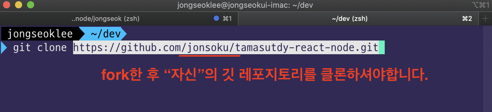
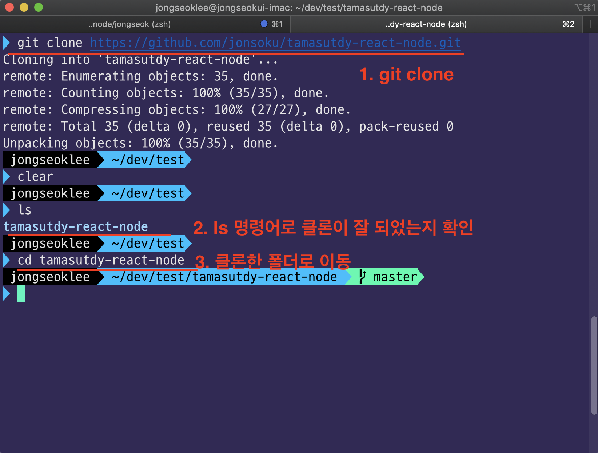
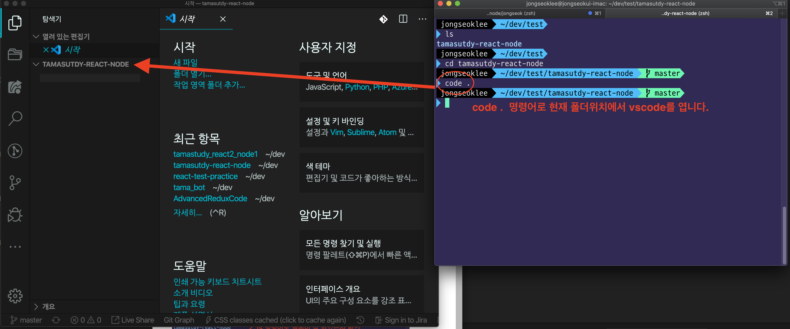
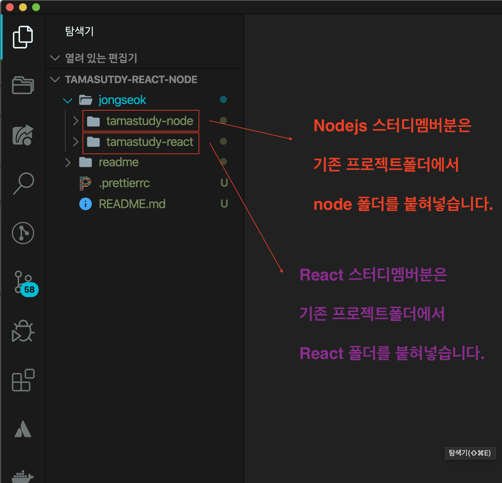

# git 작업 순서

## 원본 Repository

https://github.com/jonsoku2/tamasutdy-react-node

## 1. Fork

</img>

</img>

## 2. Clone

</img>

</img>

</img>

## 3. vscode 열기

</img>

## 4. 기존 프로젝트에서 server 폴더 및 react폴더 붙혀넣기

### 아래 스크린샷처럼 폴더명을 변경해주세요.

1. server -> tamastudy-node
2. tamastudy-react-part2 -> tamastudy-react

> 혹시 위와 다른분들께선 혼란스러워하지마시고 기존에 어떤 폴더명이던지 **node폴더**는 **tamastudy-node** **react폴더**는 **tamastudy-react**로만 바꾸시면됩니다 !

</img>

## 5. 각 폴더에 들어가서 .git 삭제하기

혹시 몰라 하는 것입니다. 설정이되어있을수도있으니.. 확인용으로
한번 해주세요.

### node폴더 내 git config 삭제

```bash
$ cd jongseok/tamastudy-node
$ rm -rf .git
```

### react폴더 내 git config 삭제

```bash
$ cd jongseok/tamastudy-react
$ rm -rf .git
```

## 6. 자신의 작업내역을 push하기

일단 자신의 레포지토리에 push합니다.

# 스터디 참고 노션

https://www.notion.so/Javscript-e86f0ef1bb164d899bc9d345d561654e
